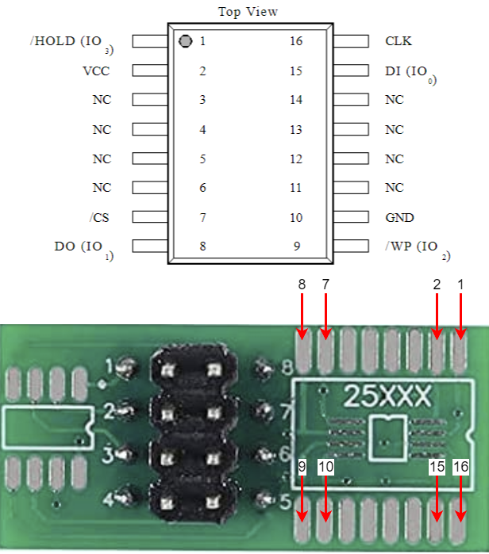

# R720-stuck-at-CPLD-solution

This repo is about how to fix the Dell PowerEdge R720 when is stuck at CPLD screen and does not POST like in this videos ([video 1](https://www.youtube.com/watch?v=cYGCpl-WI_c), [video 2](https://www.youtube.com/watch?v=2stywNoJeiQ)).

There are a bunch of topics about this issue but none brings a viable solution, this repo does:
- https://www.dell.com/community/en/conversations/poweredge-hardware-general/poweredge-r720-stuck-at-cpld/647f7f62f4ccf8a8deddcd44
- https://www.dell.com/community/en/conversations/poweredge-hardware-general/poweredge-r720-stuck-at-cpld/647f8ebdf4ccf8a8defb021f
- https://serverfault.com/questions/551716/dell-poweredge-r720xd-stuck-in-bios
- https://www.reddit.com/r/homelab/comments/e647px/dell_r720_help_idrac8/

### IMPORTANT
This is a posible solution to the problem that works for me, it does not mean is going to work for you, but you could try.

The solution I found after spend hours and hours debugging is to flash the BIOS chip due to has been corrupted.

# 1. Tools needed 🛠️

The tools needed to get the job done are:

- Soldering Iron with flux and tin (Preferible a soldering station to remove the BIOS chip from the mother board)
- Thin cables (In case you do not have a soldering station)
- [CH341 Programer](https://amzn.eu/d/5nFYJ9J)
- [Ch341a Programmer V2.2.0.0](https://ch341aprogrammersoftware.com/) (I use this one)
- Ton of patience

# 2. Procedure 📝
## 2.1. Locate the BIOS chip 🔍

Well, sounds easy right? Actually the BIOS chip is in the back of the mother board labeled as `U_SPI_BIOS`, to get access to it you have to disassemble the entire mother board, and be careful with the CPU sockets, the pins tends to bend by only looking at them.

There are not many chips in the back so is easy to spot.

  

The BIOS chip is a WINBOND 25Q64FV ([Datasheet](https://html.alldatasheet.com/html-pdf/555558/WINBOND/W25Q64FV/2402/8/W25Q64FV.html)) Page 8

## 2.2 Wiring 🧵

With soldering station you do not have to solder wires, just solder the entire chip to the daughter board.

With the help of the Datasheet and the daughter board that came with the CH341, we have to solder wires between the BIOS chip and the daughter board, if you take close attention only you have to solder pins (1, 2, 7, 8, 9, 10, 15, 16), the rest are not connected.

Cut the cables large so you can then assemble the mother board without pulling out any cable

  

My mesh looks like this:

  

## 2.2. Convert from .hdr to .bin 🤖

Due to copyright issues I can't share this entire step but I can share an approximation of the steps.

This is where the fun begins, if you expect to download the .bin or a .EXE with the .bin inside, nope. Dell decides is better to encapsulate the .bin inside a .hdr file 💩

So, first download the .exe to update the BIOS from Dell's [website](https://www.dell.com/support/home/es-es/product-support/product/poweredge-r720/drivers), open it with 7zip and extract the .hdr file from the payload folder.

Downloaded the latest version that is 2.9.0 and also the versión that is currently on the server that is the 2.2.2 to compare it later.

Then open [hexed.it](ttps://hexed.it/) and upload the BIOS .hdr file, then crop from address 0 to 54 (Select the bytes, right click, delete selected bytes), then go to the end of the file and do the same from 7FFFF0 to the end, there must be no data in addresses bellow 7FFFF0.

Now export the file as .bin and you are one step closer to fix it.

## 2.3. Flash BIOS 🔥

Unfortunately I don't have screenshots of this process 🙁

With the programer connected to the computer and the software opened, click on detect chip, after that a new windows will appear with the posible chips detected, select the only one available (It does not match what we have but it works).

Make fist a backup of the content of the chip and save it, you can compare it with the original from Dell and see if there is any difference with another program, in my case there where, I don't thing that's normal.

Before writing the chip, click on erase button to blank the chip, then select the latest version of the bios that you convert earlier and burn it all.

If wile opening the .bin file the program shows an error of incorrect size, read the conversion step closely.

The process must ends with no errors, if there is any errors check the following:
- Check the wires are connected where it should be
- Check the chip has been erased before to the write of the new bios (It happens to me once)

# 3. After intervention

The server now should be fixed, check in the screen if the version you write are the same.

If the server doesn't show picture after the process could be that the bios has been written wrong or you have crafted the .bin file incorrectly.

If none of this works, you know what to do:

  

